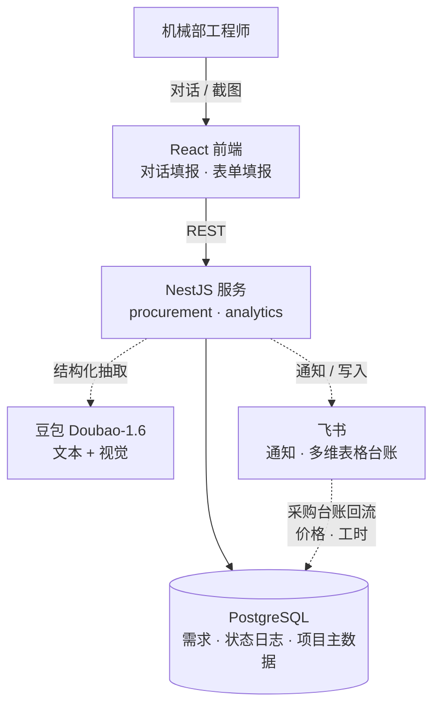
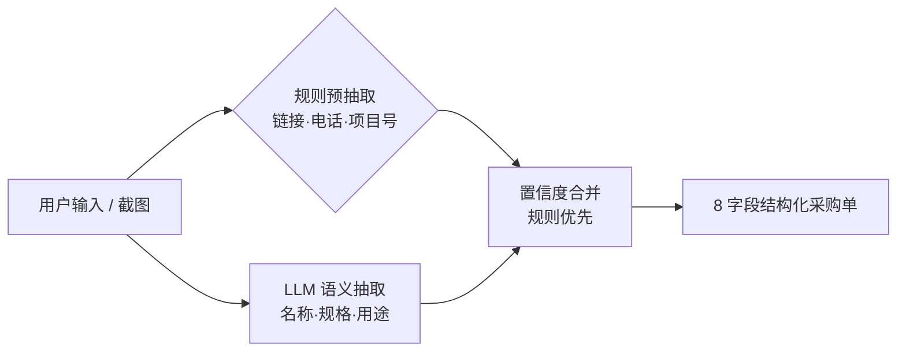

# 机械部智能自采系统 · Procurement Assistant

> 面向机械部工程师的**采购需求提报与全流程跟踪系统**。核心是用「对话式填报 + LLM 结构化抽取」把工程师口语化、碎片化的采购需求，自动转成规范、可校验、可追踪的采购单，并打通提效数据看板。

一句话价值：**把采购的非结构化入口变成结构化入口**——工程师从"发飞书消息、反复澄清"变成"一句话/一张截图搞定"，采购员从"手动整理"变成"接收干净数据"。

---

## ✨ 核心特性

- **双录入通道**：自然语言**对话式填报** + **采购截图识别**（多模态），两条路径归一到同一字段结构。
- **LLM 结构化抽取**：8 字段结构化输出，`规则 + LLM 混合路由`——结构化字段走正则（零成本、确定性），语义字段走 LLM（泛化）。
- **批量采购**：一句话多物料自动拆分；同一物料多规格（如 `型号A(40份)、型号B(50份)`）自动识别、份数求和。
- **折叠式采购单预览**：公共信息头 + 可折叠物料明细行，参考专业采购软件的 PO 排布。
- **全流程跟踪**：状态流转 + 独立审计日志；提报人/采购经办人角色；转人工兜底。
- **提效数据看板**：自建交易库 + 外部采购台账双源关联，结合人工基线算自动化 ROI。
- **可观测**：规则 vs LLM 的 shadow 对比日志 + 提取指标埋点，为评测迭代打基础。

---

## 🧱 技术栈

| 层 | 技术 | 选型理由 |
|---|---|---|
| 后端 | **NestJS 10** + TypeScript | 模块化、DI、装饰器，工程结构清晰 |
| ORM / DB | **drizzle-orm** + **PostgreSQL**（postgres.js） | schema 即 TS 代码、类型安全、SQL 透明；PG 原生支持 `jsonb`/`timestamptz`/数组/RLS |
| 前端 | **React + Vite + TypeScript** | 快构建、类型安全 |
| UI | **Tailwind CSS + shadcn/ui** | 一致的设计系统、可组合 |
| 状态 | **TanStack Query**（服务端状态）+ TanStack Form | 缓存/失效/乐观更新，替代手撸 useEffect |
| AI | **豆包 Doubao-Seed-1.6**（文本结构化抽取 + 视觉截图识别） | 结构化 JSON 输出；规则+LLM 混合，PII/结构字段不进 LLM |
| 平台 | 飞书妙搭（apaas） | 托管 PostgreSQL、鉴权、能力网关、多维表格同步 |

---

## 🏗 架构



**分层**：前端（对话/表单双模式）→ NestJS 模块（`procurement` 提报跟踪 / `analytics` 看板）→ drizzle → PostgreSQL；旁挂三个能力：LLM 抽取、飞书通知、多维表格双向同步。

---

## 🗄 数据模型（6 张核心表）

| 表 | 作用 | 关键字段 |
|---|---|---|
| `procurement_requirement` | **核心·采购需求单**（一物料一行） | `requirement_id`、`item_name`、`item_brand_model`(多规格合并串)、`item_link`、`item_quantity`、`project_code`、`status`、`requester`/`assignee`、`draft_started_at`(提效埋点) |
| `procurement_status_log` | 状态流转**审计日志** | `requirement_id`、`operator`、`old_status`/`new_status`、`extra_info`(jsonb) |
| `project_info` | 项目主数据（自动补全） | `project_code`(PK)、`project_name`、`department` |
| `purchase_record` | **同步表**·采购台账（飞书多维表格同步） | `price`、`material_category`、`platform`、`buyer_minutes`(采购员耗时) |
| `config_baseline` | 提效基线参数 | `manual_cycle_hours`、`buyer_hourly_cost`、`dept_headcount` |
| `visitor_record` | 访客记录（附属功能） | `visitor_name`、`visit_time` |

**设计要点**：交易数据（提报+状态）在自建库，外部采购台账从飞书多维表格同步，两条数据线靠 `project_code` 关联，配合基线表算提效 ROI——这是一个**双源 + 分析建模**的库，而非纯 CRUD。

---

## 🤖 AI 抽取管线

抽取不是"调一次 LLM"，而是一条分层管线：



| 层 | 内容 | 领域 |
|---|---|---|
| **L0 核心引擎** | schema 驱动的结构化信息抽取，8 字段，归一化规则与 schema 解耦 | Structured Extraction |
| **L1 可靠性** | 规则+LLM 混合路由（按置信度/成本分流）+ shadow 对比可观测 | Hybrid IE / LLMOps |
| **L2 交互** | 对话式**槽位填充**（缺哪个问哪个）+ 上下文工程（喂"已收集+当前询问+近期对话"的带状态 payload） | Task-Oriented Dialogue |
| **L3 覆盖度** | 多模态截图识别（份数换算 `⌈总量÷每份⌉`）+ 批量分解（多物料切段并行 + 多规格合并求和） | Multimodal IE |
| **L4 演进** | 物料归一/推荐（候选召回 + LLM 精判）→ Agent 接 PDM 自动申请 | Entity Linking / Agent |

**结构化输出原理**：一份 JSON Schema 同时约束三处——约束 LLM 输出、运行时校验、生成静态类型；归一化规则放在 system prompt 里与 schema 解耦。

---

## 🔐 权限模型（纵深防御）

- **应用层业务鉴权**：服务层做细粒度授权——归属校验（仅提报人可改）+ 状态机约束（仅"待采购"状态可改）。
- **数据库层 RLS**：PostgreSQL 行级安全，请求注入会话变量 `app.user_id`，策略控制工作区级读写，作为兜底。

粗粒度隔离交给 DB RLS，细粒度业务规则在应用层——即使应用层漏判，DB 层也拦得住越权。

---

## 📁 目录结构

```
client/src/
  pages/ProcurementSubmit/   # 对话填报核心（ChatArea / PreviewPanel / 抽取逻辑）
  pages/MyRequirements/       # 我的需求
  pages/Analytics/            # 提效看板
  api/                        # 前端 API 封装
server/
  database/schema.ts          # drizzle schema（6 表）
  modules/procurement/        # 提报 / 状态流转 / 飞书同步 / 看板
shared/                       # 前后端共享类型
```

---

## 🚀 本地运行

> ⚠️ 本项目基于**飞书妙搭（apaas）**平台，运行时依赖平台提供的托管 PostgreSQL、鉴权与能力网关（LLM/飞书）。脱离平台在本地独立运行，需要：自建 PostgreSQL + 自写 drizzle 连接 provider + stub 鉴权 + 把能力插件（豆包/飞书）换成直连 API。

```bash
npm install
npm run dev          # 同时起前后端
npm run type:check   # 类型检查
npm run build        # 生产构建
```

环境变量（见 `.env`，**未提交，含数据库凭据**）：
```
SUDA_DATABASE_URL=postgresql://...   # PostgreSQL 连接串
```

---

## 📊 成果

- 覆盖：机械部 **51 名工程师**全量使用；
- 提效：单个需求澄清**沟通轮次 6.5 → 0.2**；
- ROI：采购员协调工时**月省 ≈40h**。

> *指标为试点期间抽样估算；精确化方案为 `draft_started_at` + `buyer_minutes` 全量埋点。*

---

## 🗺 后续规划

- **物料归一 / 智能推荐**：抽取结果匹配标准物料主数据（候选召回 + LLM 精判重排）。
- **接入 PDM**：以 Agent（工具调用）自动完成"匹配物料 → 填表 → 提交申请"，人在环确认。
- **抽取评测流水线**：把 shadow 对比日志沉淀为评测集，按字段测准确率、持续迭代。
- **多租户化**：从部门工具升级为全公司采购需求智能入口/中台。

---

> 注：仓库内的人名、内部用户 ID、工作区标识等已做脱敏处理。
